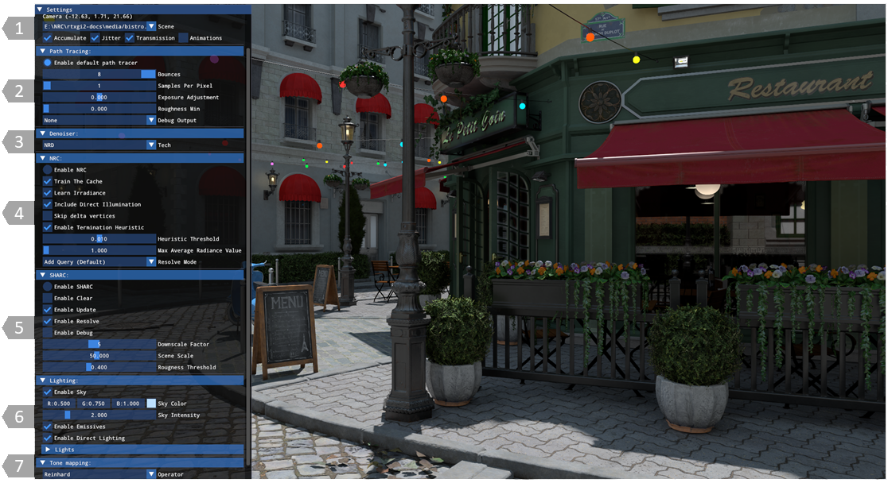

# Quick Start Guide

This document lists the necessary steps to get up and running with the RTXGI SDK pathtracer sample showcasing an example integration of the NRC and SHARC libraries in a simplified unidirectional Monte Carlo path tracer. 

For documentation and programming/integration guides specific to each technique, see the individual [NRC][NrcGuide] and [SHARC][SharcGuide] guides.


### Build steps
Assuming the tools specified in the [prerequisites][Prereq] section are available:

1. Clone the project recursively to a preferred location for the `local-repo-path` field:
    ```
    git clone --progress --recursive --branch main -v "https://github.com/NVIDIAGameWorks/RTXGI.git" "local-repo-path"
    ``` 

2. Configure and then generate the solution using CMake GUI (or the CLI) by setting the repository root as _source_ and specifying a new _build_ directory in the root.

3. Build the solution and run the `pathtracer` sample. Optionally, use the debug command line argument `-vk` to run the NVRHI Vulkan rendering backend version. 

### The pathtracer sample
This showcases an elementary path tracer that relies on either NRC or SHARC to terminate early into the respective radiance/irradiance cache for an improved signal.



**1. Global settings.** New scenes can be loaded from here via a JSON file that specifies GLTF assets and user-defined properties for common constructs such as lights and camera. Additionally, four more settings that affect the sample (regardless of radiance caching and denoising) can be toggled here.

**2. Pathtracer settings.** This section addresses typical pathtracer settings such as the number of bounces (maximum of eight), samples per pixel (SPP, maximum of 12), a global dial for altering material roughness, and a list of debug views that ensure the scene data is correctly represented (normals, worldspace positions, etc.).

**3. Denoiser selection.** This is an optional setting required when the `Animations` toggle is enabled as accumulation would not be compatible with animated content. Presently, NRD is the only supported denoising tech in this sample.

**4. NRC settings.** In this section, NRC can be toggled, fine-tuned, as well as debugged visually via the `Resolve Mode` or by directly visualizing the cache data when disabling `Enable Termination Heuristic` and visualizing the state at vertex index 0. For further details see the [in-depth NRC guide][NrcGuide]. 

**5. SHARC settings.** These provide a way to toggle the tech, manually invoke a clearing of the cache, fine-tune factors that contribute to the hash-grid data, as well as visually inspect the direct contents of the cache via the `Enable Debug` option. For further details see the [in-depth SHARC guide][SharcGuide].

**6. Lighting.** This section allows for modifying the initial light data specified in the JSON scene file.

**7. Tone mapping.** Post processing section that currently only accounts for tone mapping - useful for clamping radiance values.

[NrcGuide]: NrcGuide.md
[SharcGuide]: https://github.com/NVIDIAGameWorks/SHARC/blob/main/docs/Integration.md
[Prereq]: ../README.md/#prerequisites
